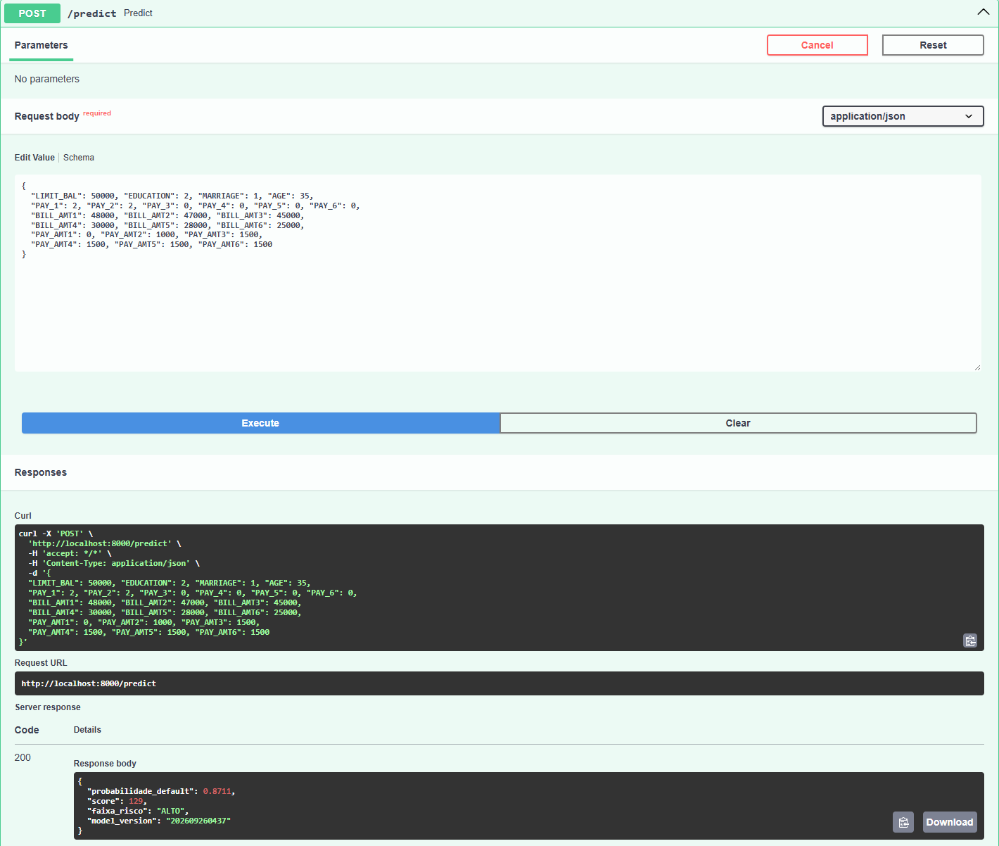
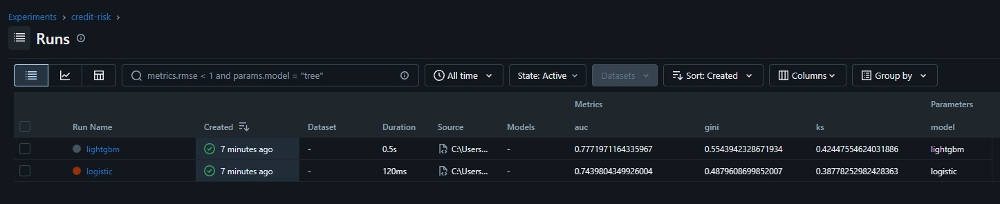
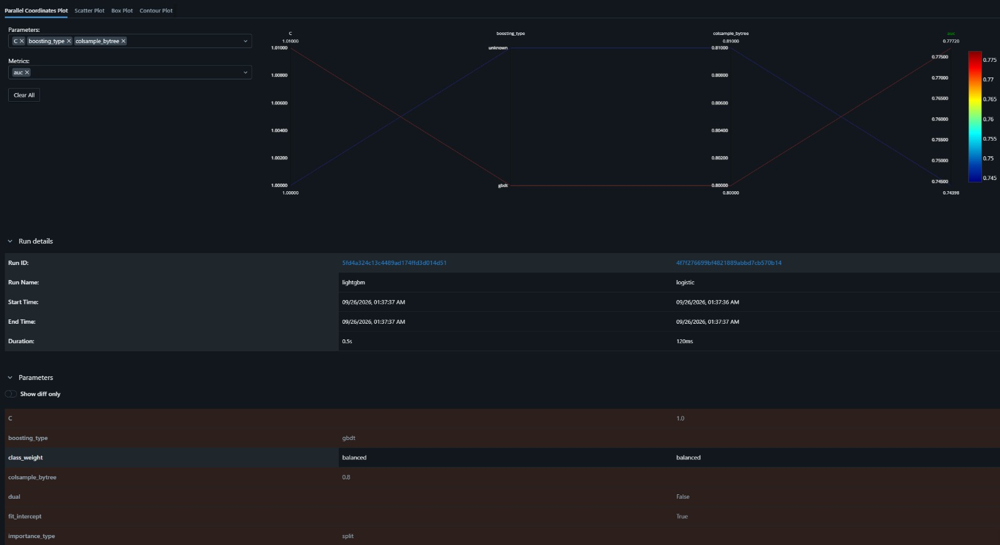

# credit-risk-api

[](https://github.com/leoscamargo/credit-risk-api/actions/workflows/ci.yml)

# Exemplo de uso

```bash
curl -X POST http://localhost:8000/predict \
  -H "Content-Type: application/json" \
  -d '{"LIMIT_BAL": 50000, "EDUCATION": 2, "MARRIAGE": 1, "AGE": 35,
       "PAY_1": 2, "PAY_2": 2, "PAY_3": 0, "PAY_4": 0, "PAY_5": 0, "PAY_6": 0,
       "BILL_AMT1": 48000, "BILL_AMT2": 47000, "BILL_AMT3": 45000,
       "BILL_AMT4": 30000, "BILL_AMT5": 28000, "BILL_AMT6": 25000,
       "PAY_AMT1": 0, "PAY_AMT2": 1000, "PAY_AMT3": 1500,
       "PAY_AMT4": 1500, "PAY_AMT5": 1500, "PAY_AMT6": 1500}'
```

Resposta:
{
  "probabilidade_default": 0.8711,
  "score": 129,
  "faixa_risco": "ALTO",
  "model_version": "202609260437"
}



# Resultados (base de teste, 6.000 clientes)

| Modelo | AUC | Gini | KS |
|---|---|---|---|
| Regressão logística (baseline) | 0,744 | 0,488 | 0,388 |
| LightGBM | **0,777** | **0,554** | **0,424** |

# Experimentos no MLflow




